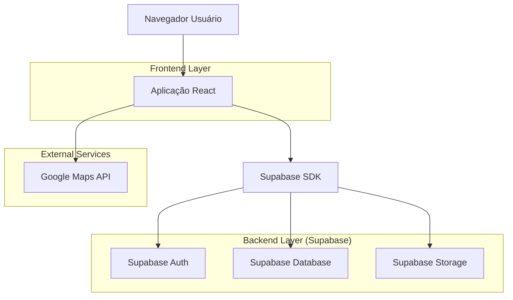
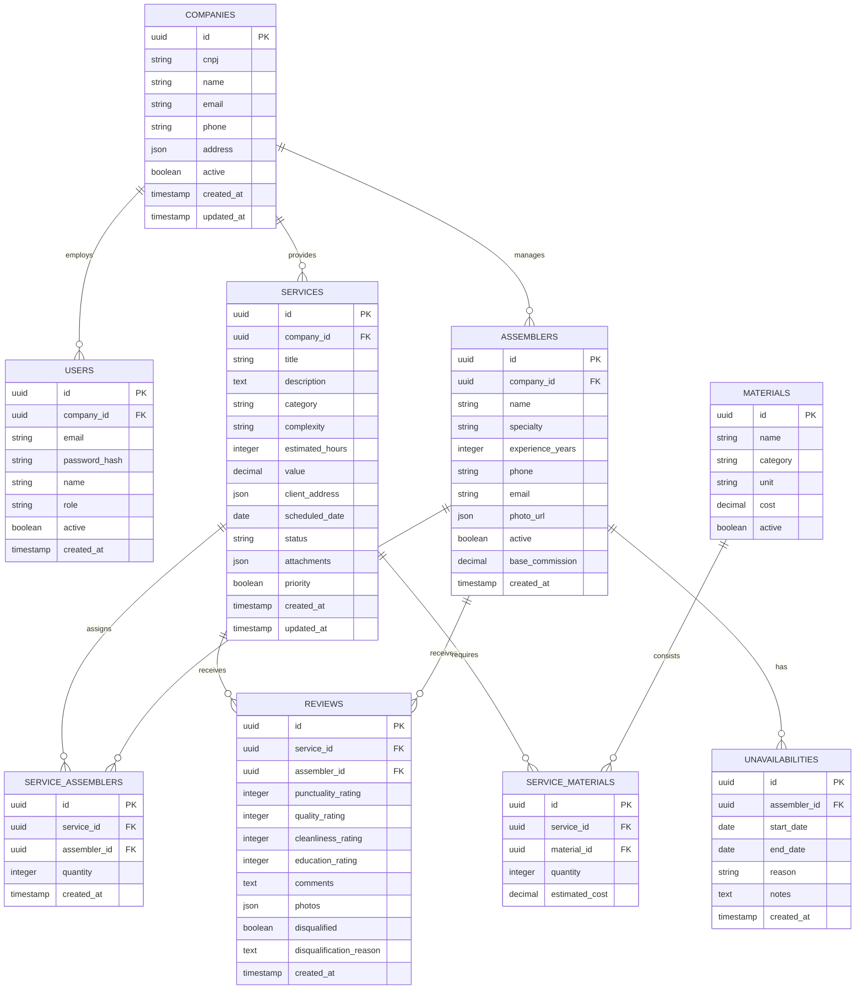

# Especificação Técnica - Sistema de Gestão para Marcenarias e Lojistas

## 1. Arquitetura do Sistema



## 2. Stack Tecnológica

- **Frontend**: React@18 + TypeScript + TailwindCSS@3 + Vite
- **Ferramenta de Inicialização**: vite-init
- **Backend**: Supabase (BaaS)
- **Banco de Dados**: PostgreSQL (via Supabase)
- **Armazenamento**: Supabase Storage
- **APIs Externas**: Google Maps JavaScript API
- **Componentes UI**: HeadlessUI + Radix UI
- **Estado Global**: Zustand
- **Validação**: React Hook Form + Zod
- **Calendário**: React Big Calendar
- **Charts**: Recharts

## 3. Definições de Rotas

| Rota | Descrição |
|------|-----------|
| /login | Página de autenticação da empresa |
| /register | Cadastro inicial de empresa |
| /dashboard | Dashboard principal com métricas |
| /services | Lista e gestão de serviços |
| /services/new | Formulário de novo serviço |
| /services/:id | Detalhes do serviço |
| /calendar | Calendário interativo de serviços |
| /team | Gestão de equipes e montadores |
| /team/:id | Perfil e desempenho do montador |
| /reviews | Avaliações e qualificações |
| /reports | Relatórios e análises |
| /settings | Configurações da empresa |

## 4. Schema do Banco de Dados

### 4.1 Modelo Entidade-Relacionamento



### 4.2 Definições DDL (Data Definition Language)

```sql
-- Tabela de Empresas
CREATE TABLE companies (
    id UUID PRIMARY KEY DEFAULT gen_random_uuid(),
    cnpj VARCHAR(14) UNIQUE NOT NULL,
    name VARCHAR(255) NOT NULL,
    email VARCHAR(255) UNIQUE NOT NULL,
    phone VARCHAR(20),
    address JSONB,
    active BOOLEAN DEFAULT true,
    created_at TIMESTAMP WITH TIME ZONE DEFAULT NOW(),
    updated_at TIMESTAMP WITH TIME ZONE DEFAULT NOW()
);

-- Tabela de Usuários (por empresa)
CREATE TABLE users (
    id UUID PRIMARY KEY DEFAULT gen_random_uuid(),
    company_id UUID REFERENCES companies(id) ON DELETE CASCADE,
    email VARCHAR(255) UNIQUE NOT NULL,
    password_hash VARCHAR(255) NOT NULL,
    name VARCHAR(255) NOT NULL,
    role VARCHAR(50) DEFAULT 'admin' CHECK (role IN ('admin', 'viewer')),
    active BOOLEAN DEFAULT true,
    created_at TIMESTAMP WITH TIME ZONE DEFAULT NOW(),
    updated_at TIMESTAMP WITH TIME ZONE DEFAULT NOW()
);

-- Tabela de Serviços
CREATE TABLE services (
    id UUID PRIMARY KEY DEFAULT gen_random_uuid(),
    company_id UUID REFERENCES companies(id) ON DELETE CASCADE,
    title VARCHAR(255) NOT NULL,
    description TEXT,
    category VARCHAR(50) CHECK (category IN ('kitchen', 'bedroom', 'living_room', 'office', 'bathroom', 'other')),
    complexity VARCHAR(20) CHECK (complexity IN ('low', 'medium', 'high', 'expert')),
    estimated_hours INTEGER,
    value DECIMAL(10,2),
    client_address JSONB NOT NULL,
    scheduled_date DATE,
    status VARCHAR(20) DEFAULT 'pending' CHECK (status IN ('pending', 'scheduled', 'in_progress', 'completed', 'delayed', 'cancelled')),
    attachments JSONB DEFAULT '[]',
    priority BOOLEAN DEFAULT false,
    created_at TIMESTAMP WITH TIME ZONE DEFAULT NOW(),
    updated_at TIMESTAMP WITH TIME ZONE DEFAULT NOW()
);

-- Tabela de Montadores
CREATE TABLE assemblers (
    id UUID PRIMARY KEY DEFAULT gen_random_uuid(),
    company_id UUID REFERENCES companies(id) ON DELETE CASCADE,
    name VARCHAR(255) NOT NULL,
    specialty VARCHAR(100),
    experience_years INTEGER,
    phone VARCHAR(20),
    email VARCHAR(255),
    photo_url JSONB,
    active BOOLEAN DEFAULT true,
    base_commission DECIMAL(5,2) DEFAULT 10.00,
    created_at TIMESTAMP WITH TIME ZONE DEFAULT NOW(),
    updated_at TIMESTAMP WITH TIME ZONE DEFAULT NOW()
);

-- Tabela de Alocação de Montadores por Serviço
CREATE TABLE service_assemblers (
    id UUID PRIMARY KEY DEFAULT gen_random_uuid(),
    service_id UUID REFERENCES services(id) ON DELETE CASCADE,
    assembler_id UUID REFERENCES assemblers(id) ON DELETE CASCADE,
    quantity INTEGER DEFAULT 1,
    created_at TIMESTAMP WITH TIME ZONE DEFAULT NOW(),
    UNIQUE(service_id, assembler_id)
);

-- Tabela de Indisponibilidades
CREATE TABLE unavailabilities (
    id UUID PRIMARY KEY DEFAULT gen_random_uuid(),
    assembler_id UUID REFERENCES assemblers(id) ON DELETE CASCADE,
    start_date DATE NOT NULL,
    end_date DATE NOT NULL,
    reason VARCHAR(50) CHECK (reason IN ('vacation', 'day_off', 'sick_leave', 'personal', 'other')),
    notes TEXT,
    created_at TIMESTAMP WITH TIME ZONE DEFAULT NOW()
);

-- Tabela de Avaliações
CREATE TABLE reviews (
    id UUID PRIMARY KEY DEFAULT gen_random_uuid(),
    service_id UUID REFERENCES services(id) ON DELETE CASCADE,
    assembler_id UUID REFERENCES assemblers(id) ON DELETE CASCADE,
    punctuality_rating INTEGER CHECK (punctuality_rating >= 1 AND punctuality_rating <= 5),
    quality_rating INTEGER CHECK (quality_rating >= 1 AND quality_rating <= 5),
    cleanliness_rating INTEGER CHECK (cleanliness_rating >= 1 AND cleanliness_rating <= 5),
    education_rating INTEGER CHECK (education_rating >= 1 AND education_rating <= 5),
    comments TEXT,
    photos JSONB DEFAULT '[]',
    disqualified BOOLEAN DEFAULT false,
    disqualification_reason TEXT,
    commission_calculated BOOLEAN DEFAULT false,
    final_commission DECIMAL(10,2),
    created_at TIMESTAMP WITH TIME ZONE DEFAULT NOW()
);

-- Índices para performance
CREATE INDEX idx_services_company_id ON services(company_id);
CREATE INDEX idx_services_scheduled_date ON services(scheduled_date);
CREATE INDEX idx_services_status ON services(status);
CREATE INDEX idx_services_priority ON services(priority);
CREATE INDEX idx_assemblers_company_id ON assemblers(company_id);
CREATE INDEX idx_service_assemblers_service_id ON service_assemblers(service_id);
CREATE INDEX idx_service_assemblers_assembler_id ON service_assemblers(assembler_id);
CREATE INDEX idx_unavailabilities_assembler_id ON unavailabilities(assembler_id);
CREATE INDEX idx_unavailabilities_date_range ON unavailabilities(start_date, end_date);
CREATE INDEX idx_reviews_service_id ON reviews(service_id);
CREATE INDEX idx_reviews_assembler_id ON reviews(assembler_id);

-- Políticas de Segurança (RLS - Row Level Security)
ALTER TABLE companies ENABLE ROW LEVEL SECURITY;
ALTER TABLE users ENABLE ROW LEVEL SECURITY;
ALTER TABLE services ENABLE ROW LEVEL SECURITY;
ALTER TABLE assemblers ENABLE ROW LEVEL SECURITY;
ALTER TABLE service_assemblers ENABLE ROW LEVEL SECURITY;
ALTER TABLE unavailabilities ENABLE ROW LEVEL SECURITY;
ALTER TABLE reviews ENABLE ROW LEVEL SECURITY;

-- Permissões básicas para usuários autenticados
CREATE POLICY "Users can only see their company data" ON users
    FOR ALL USING (auth.uid() IN (SELECT id FROM users WHERE company_id = users.company_id));

CREATE POLICY "Companies can manage their own services" ON services
    FOR ALL USING (company_id = (SELECT company_id FROM users WHERE id = auth.uid()));

CREATE POLICY "Companies can manage their assemblers" ON assemblers
    FOR ALL USING (company_id = (SELECT company_id FROM users WHERE id = auth.uid()));
```

## 5. Arquitetura Frontend

### 5.1 Estrutura de Componentes

```
src/
├── components/
│   ├── auth/
│   │   ├── LoginForm.tsx
│   │   ├── RegisterForm.tsx
│   │   └── ProtectedRoute.tsx
│   ├── dashboard/
│   │   ├── MetricsCard.tsx
│   │   ├── PerformanceChart.tsx
│   │   └── ServiceSummary.tsx
│   ├── services/
│   │   ├── ServiceForm.tsx
│   │   ├── ServiceList.tsx
│   │   ├── ServiceCalendar.tsx
│   │   └── ServiceDetails.tsx
│   ├── team/
│   │   ├── AssemblerForm.tsx
│   │   ├── AssemblerList.tsx
│   │   ├── AvailabilityCalendar.tsx
│   │   └── TeamAllocation.tsx
│   ├── reviews/
│   │   ├── ReviewForm.tsx
│   │   ├── StarRating.tsx
│   │   ├── ReviewList.tsx
│   │   └── PerformanceReport.tsx
│   └── shared/
│       ├── Layout.tsx
│       ├── Navigation.tsx
│       ├── FileUpload.tsx
│       └── LoadingSpinner.tsx
├── hooks/
│   ├── useAuth.ts
│   ├── useServices.ts
│   ├── useCalendar.ts
│   ├── useTeam.ts
│   └── useReviews.ts
├── stores/
│   ├── authStore.ts
│   ├── serviceStore.ts
│   ├── teamStore.ts
│   └── uiStore.ts
├── utils/
│   ├── supabase.ts
│   ├── maps.ts
│   ├── calculations.ts
│   └── validators.ts
└── types/
    ├── auth.types.ts
    ├── service.types.ts
    ├── team.types.ts
    └── review.types.ts
```

### 5.2 Estado Global (Zustand)

```typescript
// authStore.ts
interface AuthStore {
  user: User | null;
  company: Company | null;
  isAuthenticated: boolean;
  login: (email: string, password: string) => Promise<void>;
  logout: () => void;
  register: (data: RegisterData) => Promise<void>;
}

// serviceStore.ts
interface ServiceStore {
  services: Service[];
  selectedService: Service | null;
  loading: boolean;
  filters: ServiceFilters;
  fetchServices: (filters?: ServiceFilters) => Promise<void>;
  createService: (data: CreateServiceData) => Promise<void>;
  updateService: (id: string, data: UpdateServiceData) => Promise<void>;
  deleteService: (id: string) => Promise<void>;
  allocateAssemblers: (serviceId: string, assemblerIds: string[]) => Promise<void>;
}
```

## 6. Regras de Negócio

### 6.1 Sistema de Indisponibilidade

```typescript
// Validação de conflitos de indisponibilidade
function validateAssemblerAvailability(
  assemblerId: string,
  startDate: Date,
  endDate: Date
): Promise<boolean> {
  // Verifica se existe sobreposição de datas
  // Retorna true se disponível, false se houver conflito
}

// Notificação automática de serviços conflitantes
async function notifyConflictingServices(assemblerId: string, unavailability: Unavailability) {
  // Busca serviços agendados no período
  // Envia notificações para empresa sobre conflitos
  // Sugere montadores alternativos
}
```

### 6.2 Sistema de Priorização

```typescript
// Lógica de priorização de serviços
enum PriorityLevel {
  LOW = 0,
  NORMAL = 1,
  HIGH = 2,
  URGENT = 3
}

function calculateServicePriority(service: Service): PriorityLevel {
  let priority = PriorityLevel.NORMAL;
  
  // Verifica se está marcado como urgente
  if (service.priority) {
    priority = PriorityLevel.URGENT;
  }
  
  // Verifica dias até o prazo
  const daysUntilDue = differenceInDays(service.scheduled_date, new Date());
  
  if (daysUntilDue <= 1) {
    priority = Math.max(priority, PriorityLevel.HIGH);
  } else if (daysUntilDue <= 3) {
    priority = Math.max(priority, PriorityLevel.NORMAL);
  }
  
  // Verifica complexidade
  if (service.complexity === 'expert') {
    priority = Math.max(priority, PriorityLevel.HIGH);
  }
  
  return priority;
}

// Ordenação automática por prioridade
function sortServicesByPriority(services: Service[]): Service[] {
  return services.sort((a, b) => {
    const priorityA = calculateServicePriority(a);
    const priorityB = calculateServicePriority(b);
    
    if (priorityA !== priorityB) {
      return priorityB - priorityA; // Decrescente
    }
    
    return new Date(a.scheduled_date).getTime() - new Date(b.scheduled_date).getTime();
  });
}
```

### 6.3 Sistema de Comissão

```typescript
// Cálculo de comissão baseada em avaliações
interface CommissionCalculation {
  baseValue: number;
  ratingMultiplier: number;
  finalCommission: number;
  breakdown: {
    base: number;
    qualityBonus: number;
    punctualityBonus: number;
    total: number;
  };
}

function calculateCommission(
  serviceValue: number,
  review: Review,
  baseCommissionRate: number
): CommissionCalculation {
  // Calcula média de avaliação
  const averageRating = (
    review.punctuality_rating +
    review.quality_rating +
    review.cleanliness_rating +
    review.education_rating
  ) / 4;
  
  // Define multiplicador baseado na média
  let ratingMultiplier = 0.8; // Padrão baixo
  
  if (averageRating >= 4.5) {
    ratingMultiplier = 1.2; // Excelente
  } else if (averageRating >= 4.0) {
    ratingMultiplier = 1.1; // Muito bom
  } else if (averageRating >= 3.5) {
    ratingMultiplier = 1.0; // Bom
  } else if (averageRating >= 3.0) {
    ratingMultiplier = 0.9; // Regular
  }
  
  // Aplica penalidade por desqualificação
  if (review.disqualified) {
    ratingMultiplier = 0.5;
  }
  
  const baseCommission = serviceValue * (baseCommissionRate / 100);
  const finalCommission = baseCommission * ratingMultiplier;
  
  return {
    baseValue: serviceValue,
    ratingMultiplier,
    finalCommission,
    breakdown: {
      base: baseCommission,
      qualityBonus: finalCommission - baseCommission,
      punctualityBonus: 0, // Pode ser expandido
      total: finalCommission
    }
  };
}

// Processamento em lote de comissões
async function processMonthlyCommissions(
  companyId: string,
  month: number,
  year: number
): Promise<Map<string, number>> {
  const commissions = new Map<string, number>();
  
  // Busca todos os serviços concluídos no período
  const completedServices = await getCompletedServices(companyId, month, year);
  
  for (const service of completedServices) {
    const review = await getServiceReview(service.id);
    const assemblers = await getServiceAssemblers(service.id);
    
    if (review && assemblers.length > 0) {
      const commission = calculateCommission(
        service.value,
        review,
        assemblers[0].base_commission
      );
      
      // Divide comissão igualmente entre montadores
      const commissionPerAssembler = commission.finalCommission / assemblers.length;
      
      for (const assembler of assemblers) {
        const current = commissions.get(assembler.id) || 0;
        commissions.set(assembler.id, current + commissionPerAssembler);
      }
      
      // Marca comissão como calculada
      await markCommissionAsCalculated(review.id, commission.finalCommission);
    }
  }
  
  return commissions;
}
```

### 6.4 Integração com Google Maps

```typescript
// Cálculo de rotas e tempos de deslocamento
interface RouteCalculation {
  origin: LatLng;
  destination: LatLng;
  distance: number; // em metros
  duration: number; // em segundos
  trafficMultiplier: number;
}

async function calculateServiceRoute(
  assemblerAddress: Address,
  clientAddress: Address,
  scheduledTime: Date
): Promise<RouteCalculation> {
  const directionsService = new google.maps.DirectionsService();
  
  const request: DirectionsRequest = {
    origin: `${assemblerAddress.street}, ${assemblerAddress.number}, ${assemblerAddress.city}`,
    destination: `${clientAddress.street}, ${clientAddress.number}, ${clientAddress.city}`,
    travelMode: google.maps.TravelMode.DRIVING,
    drivingOptions: {
      departureTime: scheduledTime,
      trafficModel: google.maps.TrafficModel.PESSIMISTIC
    }
  };
  
  const result = await directionsService.route(request);
  const route = result.routes[0];
  const leg = route.legs[0];
  
  return {
    origin: leg.start_location,
    destination: leg.end_location,
    distance: leg.distance.value,
    duration: leg.duration.value,
    trafficMultiplier: leg.duration_in_traffic ? 
      leg.duration_in_traffic.value / leg.duration.value : 1
  };
}

// Otimização de alocação considerando deslocamento
async function optimizeAssemblerAllocation(
  service: Service,
  availableAssemblers: Assembler[]
): Promise<OptimizedAllocation> {
  const allocations: OptimizedAllocation[] = [];
  
  for (const assembler of availableAssemblers) {
    const route = await calculateServiceRoute(
      assembler.address,
      service.client_address,
      new Date(service.scheduled_date)
    );
    
    // Calcula score baseado em:
    // - Distância (menor é melhor)
    // - Tempo de deslocamento (menor é melhor)
    // - Avaliações recentes (maior é melhor)
    const distanceScore = 1 / (route.distance / 1000 + 1); // Normaliza por km
    const timeScore = 1 / (route.duration / 3600 + 1); // Normaliza por hora
    const ratingScore = await getAssemblerRecentRating(assembler.id);
    
    const totalScore = (distanceScore * 0.3) + (timeScore * 0.3) + (ratingScore * 0.4);
    
    allocations.push({
      assembler,
      route,
      score: totalScore,
      estimatedArrival: new Date(Date.now() + route.duration * 1000)
    });
  }
  
  // Ordena por score decrescente
  allocations.sort((a, b) => b.score - a.score);
  
  return allocations[0];
}
```

## 7. APIs e Integrações

### 7.1 Google Maps API

```typescript
// Configuração do cliente Google Maps
const mapsConfig = {
  apiKey: import.meta.env.VITE_GOOGLE_MAPS_API_KEY,
  libraries: ['places', 'directions', 'geometry'],
  version: 'weekly'
};

// Hook para uso de geocoding
export function useGeocoding() {
  const geocoder = useRef<google.maps.Geocoder>();
  
  useEffect(() => {
    if (window.google) {
      geocoder.current = new google.maps.Geocoder();
    }
  }, []);
  
  const geocodeAddress = async (address: string): Promise<LatLng> => {
    if (!geocoder.current) throw new Error('Geocoder not initialized');
    
    return new Promise((resolve, reject) => {
      geocoder.current!.geocode({ address }, (results, status) => {
        if (status === 'OK' && results[0]) {
          resolve({
            lat: results[0].geometry.location.lat(),
            lng: results[0].geometry.location.lng()
          });
        } else {
          reject(new Error('Geocoding failed'));
        }
      });
    });
  };
  
  return { geocodeAddress };
}
```

### 7.2 Supabase Real-time

```typescript
// Inscrição em mudanças em tempo real
export function useServiceRealtime(companyId: string) {
  const [services, setServices] = useState<Service[]>([]);
  
  useEffect(() => {
    const subscription = supabase
      .channel('services-changes')
      .on(
        'postgres_changes',
        {
          event: '*',
          schema: 'public',
          table: 'services',
          filter: `company_id=eq.${companyId}`
        },
        (payload) => {
          if (payload.eventType === 'INSERT') {
            setServices(prev => [...prev, payload.new as Service]);
          } else if (payload.eventType === 'UPDATE') {
            setServices(prev => 
              prev.map(s => s.id === payload.new.id ? payload.new as Service : s)
            );
          } else if (payload.eventType === 'DELETE') {
            setServices(prev => prev.filter(s => s.id !== payload.old.id));
          }
        }
      )
      .subscribe();
    
    return () => {
      subscription.unsubscribe();
    };
  }, [companyId]);
  
  return services;
}
```

## 8. Segurança e Performance

### 8.1 Otimizações de Performance

- **Paginação**: Limite de 50 registros por página nas listagens
- **Lazy Loading**: Carregamento sob demanda de imagens e documentos
- **Cache Local**: Uso de IndexedDB para cache offline de dados críticos
- **Debouncing**: 300ms de delay nas buscas e filtros
- **Virtualização**: Listas longas com react-window

### 8.2 Segurança

- **CORS**: Configurado apenas para domínios autorizados
- **Rate Limiting**: Máximo de 100 requisições por minuto por IP
- **Validação**: Todas as entradas validadas com Zod schemas
- **Sanitização**: Remoção de XSS em campos de texto livre
- **Criptografia**: Senhas com bcrypt (salt rounds: 12)
- **HTTPS**: Obrigatório em produção

### 8.3 Monitoramento

- **Analytics**: Google Analytics 4 para tracking de uso
- **Error Tracking**: Sentry para captura de erros em produção
- **Performance**: Web Vitals monitoring com relatórios semanais
- **Uptime**: Monitoramento com Pingdom (99.9% SLA)