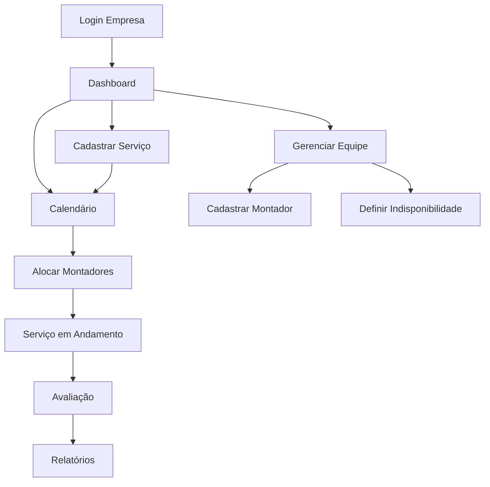

## 1. Product Overview
Sistema completo de gestão para empresas de marcenaria e lojistas, permitindo o gerenciamento eficiente de serviços de montagem, equipes de montadores e qualidade dos serviços prestados.

O sistema resolve o problema de desorganização na alocação de montadores, falta de controle de qualidade e dificuldade no acompanhamento de serviços, proporcionando uma plataforma unificada para gestão empresarial com foco em produtividade e qualidade.

## 2. Core Features

### 2.1 User Roles
| Role | Registration Method | Core Permissions |
|------|---------------------|------------------|
| Empresa | Cadastro inicial com CNPJ e email | Gerenciar serviços, montadores, visualizar dashboard |
| Montador | Cadastro pela empresa | Visualizar serviços alocados, atualizar status |
| Administrador | Cadastro direto | Gerenciar todas as empresas, acessar relatórios globais |

### 2.2 Feature Module
Nosso sistema de gestão consiste nas seguintes páginas principais:
1. **Portal da Empresa**: dashboard com métricas, acesso rápido às funcionalidades principais.
2. **Cadastro de Serviços**: formulário completo para novos serviços com upload de documentos.
3. **Calendário de Serviços**: visualização interativa com drag-and-drop e status coloridos.
4. **Gestão de Equipes**: cadastro e alocação de montadores com disponibilidade em tempo real.
5. **Avaliação de Serviços**: interface de qualificação com sistema de estrelas e comentários.
6. **Login/Cadastro**: autenticação individual por empresa com registro inicial.

### 2.3 Page Details
| Page Name | Module Name | Feature description |
|-----------|-------------|---------------------|
| Portal da Empresa | Dashboard | Exibir total de serviços ativos, concluídos, avaliações médias, montadores disponíveis. |
| Portal da Empresa | Métricas | Mostrar gráficos de desempenho mensal, serviços por categoria, tempo médio de conclusão. |
| Cadastro de Serviços | Formulário | Incluir tipo de móvel, tempo estimado, complexidade, endereço, valor, categoria. |
| Cadastro de Serviços | Upload | Permitir anexar imagens e documentos técnicos do serviço. |
| Calendário de Serviços | Visualização | Alternar entre diária, semanal e mensal com cores indicando status. |
| Calendário de Serviços | Reagendamento | Arrastar e soltar serviços para novas datas com confirmação. |
| Calendário de Serviços | Notificações | Alertar sobre prazos próximos e serviços atrasados automaticamente. |
| Gestão de Equipes | Cadastro Montador | Registrar nome, especialidade, anos experiência, foto, documentos. |
| Gestão de Equipes | Alocação | Atribuir montadores a serviços com controle de quantidade mín/máx. |
| Gestão de Equipes | Disponibilidade | Visualizar em tempo real montadores ocupados e disponíveis. |
| Avaliação de Serviços | Qualificação | Avaliar pontualidade, qualidade, limpeza, educação com estrelas 1-5. |
| Avaliação de Serviços | Comentários | Adicionar texto e fotos do serviço concluído. |
| Avaliação de Serviços | Relatórios | Gerar desempenho individual por montador em períodos selecionados. |
| Login/Cadastro | Autenticação | Login com email e senha, recuperação de senha, cadastro inicial. |

## 3. Core Process

### Fluxo Principal da Empresa:
1. Empresa acessa o portal e faz login com suas credenciais únicas
2. No dashboard, visualiza métricas gerais e serviços pendentes
3. Cadastra novo serviço com todas as informações necessárias
4. Acessa o calendário para alocar montadores ao serviço
5. Montador executa o serviço e atualiza o status
6. Após conclusão, cliente avalia o serviço e montador
7. Sistema calcula comissão baseada na avaliação

### Fluxo de Gestão de Equipes:
1. Empresa cadastra montadores com especialidades
2. Define períodos de indisponibilidade (férias, folgas)
3. Aloca montadores aos serviços conforme necessidade
4. Acompanha desempenho através de avaliações
5. Gera relatórios de produtividade individual

## 4. User Interface Design

### 4.1 Design Style
- **Cores Primárias**: Azul marceneiro (#2C5282) e Madeira (#8B4513)
- **Cores Secundárias**: Verde sucesso (#38A169), Vermelho alerta (#E53E3E), Cinza neutro (#718096)
- **Botões**: Estilo arredondado com sombra suave, hover com transição
- **Fontes**: Inter para textos, Roboto Condensed para títulos
- **Layout**: Baseado em cards com sombras, navegação lateral fixa
- **Ícones**: Estilo outline da Feather Icons, consistente em todo sistema

### 4.2 Page Design Overview
| Page Name | Module Name | UI Elements |
|-----------|-------------|-------------|
| Dashboard | Métricas | Cards com números destacados, gráficos de pizza/barras, ícones coloridos |
| Calendário | Grid | Células coloridas por status, tooltips ao hover, botões de navegação mensal |
| Formulário Serviço | Campos | Inputs com labels acima, dropdowns categorizados, upload com preview |
| Gestão Equipe | Lista | Cards horizontais com foto, badges de especialidade, status online/offline |
| Avaliação | Estrelas | Star rating interativo, textarea para comentários, upload de fotos |

### 4.3 Responsiveness
Desktop-first com adaptação mobile completa. Sidebar vira menu hamburger em telas < 768px. Cards empilham verticalmente. Calendário alterna para visualização de lista em mobile. Touch otimizado com botões maiores e swipe gestures.

### 4.4 3D Scene Guidance
Não aplicável - Sistema é 2D com foco em funcionalidade e usabilidade.